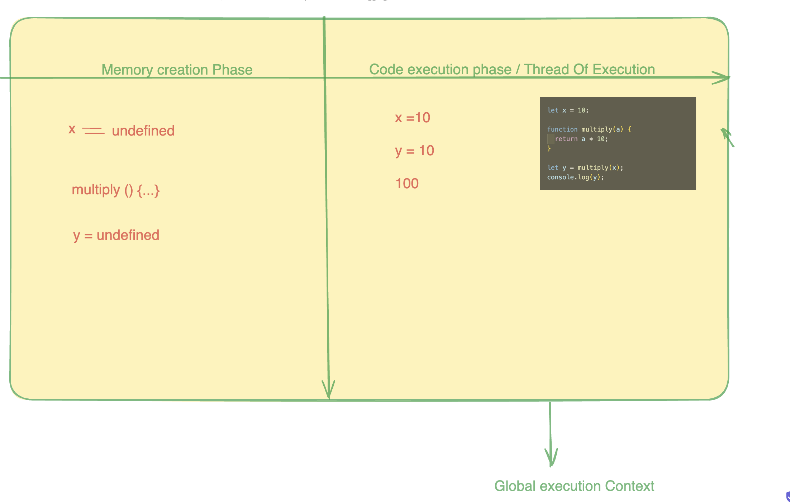

## Execution Context

When a Js Program runs , a global execution context is created. Generally It has two components :

- one is memory creation Phase
- Another is code execution Phase.

In the 1st phase , It searches all Program variable & it creates memory for them & assign undefined value to those variable but in the case of function, it stores all the codes in memory phase.

During the execution phase, the js engine executes the code line by line assigning the values to the variable & executes the function calls. Also for every new function create , the JS engine creates a new execution context all together



## Hoisting

Hoisting is JS's default behaviour of moving declarations to the top or we can say that a variable can be used before its declaration.

```js
console.log(x);
var x = 10;

//undefined
```

in the above example , it gives us undefined because when a js program runs , in the memory creation phase `x = undefined` thatswhy. In this case it is hoisted.

Lets take another example with `let`

```js
console.log(x);

let x = 10;

// It gives error
// Cannot access 'x' before initialization
```

In this case, an error occurs. You believed that they are not hoisted, but you are mistaken. They are hoisted in the `temporal dead zone(TDZ)`.

```js
getName();
getName2();

function getName() {
  console.log("heyy");
}

var getName2 = () => {
  console.log("kumar");
};

//heyy
//getName2 is not a function
```

in the example, we can infer that Arrow function does not executed before its declaration whereas normal funnction gets executed.

## Temporal Dead Zone (TDZ)

The Temporal Dead Zone (TDZ) in JavaScript is a period when variables declared with let or const are present but cannot be used until they are fully set up. Imagine it like a waiting room for variables – they are there, but you can't interact with them until they are officially ready.

For example, if you write:

```js
console.log(myVar); // This will throw a ReferenceError
let myVar = 10;
```

In this case, even though myVar is declared, trying to use it before assigning a value will cause an error because it's still in the TDZ. To avoid this, make sure to assign a value before using the variable:

```js
let myVar = 10;
console.log(myVar); // This will work fine
```
