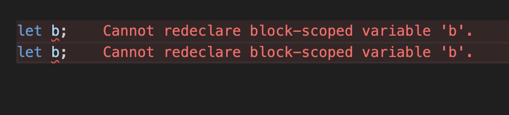
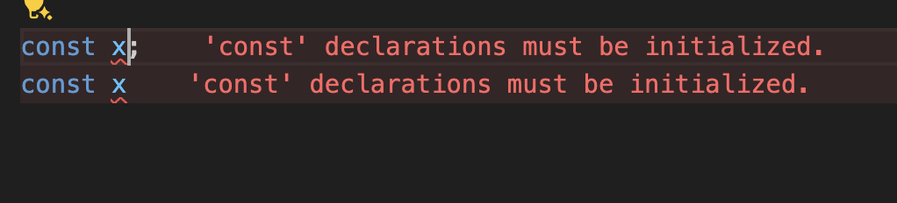

# What is Variable Shadowing in Javascript ?

To understand variable Shadowing , first understand What is Scope and how it Works?

In Javascript, we have `global`, `function` and `block` scope.

The Scope is something like a container that has other container inside it.When a variable is scoped , it means that this variable is accessible only inside this scope and in the other scope inside of it. However, these variables are not accessible outside of this scope,Container .

Variable declared with `var` is global scoped as well as function scoped, it means if we create a variable inside a function , it will not be accessible outside the function.

However the `let` and `const` are also function scope but at the same time they are block scoped , it means that if they are declared within a block of code enclosed in curly braces like in if statements, loops, or switch statements, they cannot be accessed outside of that specific block.

## Variable Shadowing

For example we have two variable with same name but they contains different values and we create them in different scopes. the first variable is located in global scope and another is in function scope .

```js
//Variable declare in Global Scope
let animal = "Cat";

function getName() {
  //Variable declare in function Scope
  let animal = "Dog";
  console.log(animal);
}

getName();
console.log(animal);

//Dog
//Cat
```

The inner scope usually is supposed to have access to the outer scope however when we declare the same variable things change.

in this example, outer scope is global and the inner scope is function scope. This is called `Shadowing or Variable Shadowing` in Javascript.

The concept also holds true for `block scope` due to the block-scoping nature of the `let` keyword.

```js
//Variable declare in Global scope
let count = 10;

//variable declare in block scope
for (let count = 0; count < 5; count++) {
  console.log(`Current count: ${count}`);
}

console.log(count);

//Current count: 0
//Current count: 1
//Current count: 2
//Current count: 3
//Current count: 4
//10
```

now lets use same example with the var . Var is function scoped so it behaves same as above

```js
//Variable declare in Global Scope
var animal = "Cat";

function getName() {
  //Variable declare in function Scope
  var animal = "Dog";
  console.log(animal);
}

getName();
console.log(animal);

//Dog
//Cat
```

Now lets use `var` in block scope. Var is not block scoped so it behaves differently.

```js
//Variable declare in Global scope
var count1 = 10;

//variable declare in block scope
for (var count1 = 0; count1 < 5; count1++) {
  console.log(`Current count: ${count1}`);
}

console.log(count1);

//Current count: 1
//Current count: 2
//Current count: 3
//Current count: 4
//5
```

Now let us take another example to understand better how `var` works

```js
var x = "Prabir";

if (true) {
  var x = "kumar";
  console.log(x);
}

console.log(x);

//kumar
//kumar
```

in this case the value of var change because it is not block scoped. This means it doesn't get trapped,So no variable shadowing happening here.

## Illegal Shadowing

Besides variable shadowing, there is also a concept known as illegal shadowing.

If you create a variable in a global scope with the `let `keyword and another variable with the `var` keyword in a block scope but the exact same name, it will throw an error. This is called illegal shadowing.

```js
let name = "Prabir";

if (true) {
  var name = "kumar";
  console.log(name);
}

console.log(name);

//uncaught syntax error
//it will give error
```

## Declaration

We can declare the variable as many times we want with the help of `var`. var can be redeclared in the same scope

```js
var x;
var x;
```

We can not redeclare the variable with the `let` keyword. it gives error.



Same things happened for `const`.it is a constant so we cant redeclare the variable using const keyword.



Notes:

- `let` and `const` can not be redeclare in the same scope but `var` can be redeclare in the same scope.

```js
let name;
{
  let name;
}

// it can be possible because of shadowing
```

## Declaration without Initialisation

We can declare the variable without initialisation in the case of `let` and `var` but in the case of `const` it gives error that missing initializer in const declaration. So while we declare the variable with const we must give value.

## Re-Initialisation

We can re-initialise with the help of `let` and `var`.

for example:

```js
var a = 5;

a = 10; // this will work

let b = 15;

b = 20; //this will also work
```

But in the case of `const` it gives an error that `Assignment to constant variable.`

```js
const a = 5;

a = 7; //   Error! Assignment to constant variable
```

Notes:

- `var` and `let` can be updated but `const` can't be updated.
